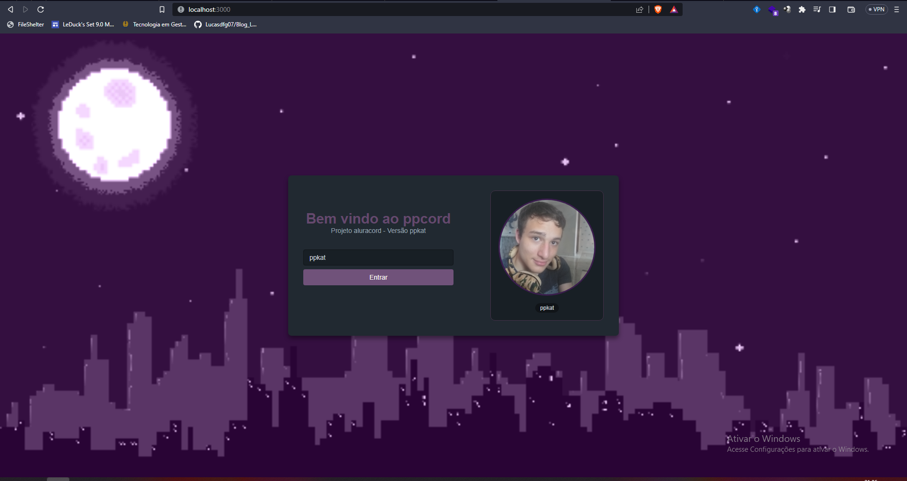
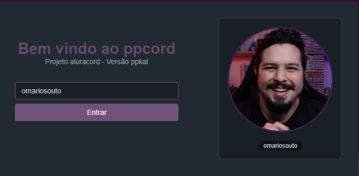
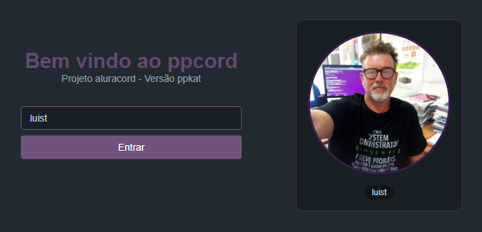
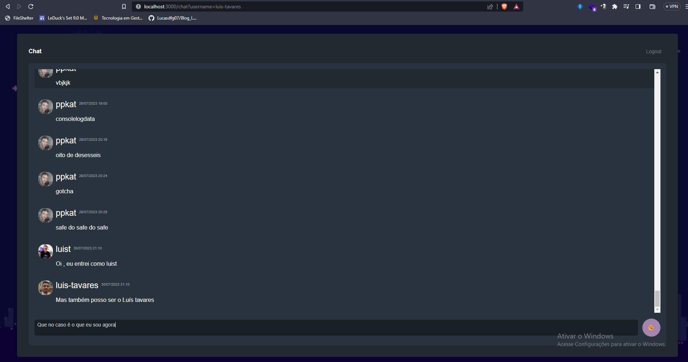

# Discord React clone
Este projeto foi feito durante uma imersão react da alura e tem o propósito de mostrar o poder e capacidade do React, tecnologia que permeia a web.
Utilizando o React, este projeto simula o discord de forma totalmente funcional, com login pelo nickname do github e mensagens que são armazenadas em banco de dados.

## Tecnologias

Estas são as tecnologias utilizadas no projeto:

* React versão 17.0.2
* Nextjs versão 12.0.8
* Skynexui versão 1.24.2
* Supabase


## Instalação

1 - Instale o [nodejs](https://nodejs.org/) pelo site

2 - Execute o seguinte comando no seu terminal para baixar o projeto:
   
```sh
git clone https://github.com/ppkat/Discord-clone-react.git
```

3 - Instale as dependências abrindo o a pasta do projeto e executando o comando:

```
npm i
```

4 - Configure as variáveis de ambiente de acordo com as credenciais do seu supabase:
```
NEXT_PUBLIC_SUPABASE_ANON_KEY = 'sua_anon_key_do_supabase'
NEXT_PUBLIC_SUPABASE_URL = 'sua supabase url'
```

## Como utilizar

### 1 - Depois de rodar o projeto com "npm run dev" ou rodar o production ("npm run build" + "npm run start") e acessar o htttp://localhost:3000, você verá a página inicial de login



### 2 - A foto de perfil é dinâmica e você pode colocar o seu nickname do github que a foto será alterada ao vivo




### 3 - Ao dar enter ou ao clicar no botão de entrar, você será direcionado para a página de chat, e lá verá todas as mensagens que ja foram enviadas nesta aplicação



### 4 - Agora você pode enviar a mensagem que quiser que ficará salva com o seu nick e sua foto do github

## Versão

  1.0.0.0

## Autores

* **João Pedro Gaspar Pereira** 

Obrigado pela visita!
